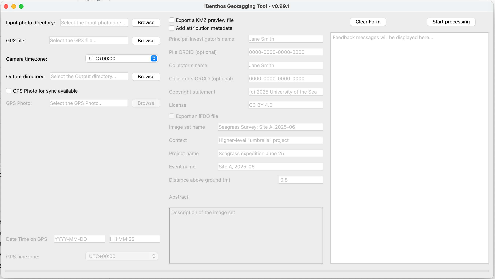

# iBenthos Geotagging Tool Usage documentation

## Installation

### MacOS

1. Download the ZIP file. This file contains the Application.
2. Extract the Application from the ZIP file.
3. Drag the Application to the Applications directory.
4. Start the tool by double clicking the Application.

#### Known issue: application not launching due to security

This is a known issue while we're testing with just a developer ID certificate.
To get around this:

1. Open System Settings
2. Scroll and open "Privacy & Security"
3. Scroll down to "Security" section
4. You should see a message near the bottom that says something like: "'iBenthos Geotagging Tool.app' was blocked from opening because it is not from an identified developer."
5. Next to this message, you'll see a button that says "Open Anyway". Click it.
6. A confirmation dialog will appear. Click "Open".

### Windows

1. Download the Windows Installer.
2. Double click the installer and follow the installer instructions.
3. iBenthos Geotagging Tool should now be installed. You can find it in the Start Menu.

## Usage

To use this tool, you'll need:
- Photos you'll like to geotag
- A GPX file which was collected by a GPS unit with the camera
- (optional) A reference photo of the GPS unit with the date and time taken with the same camera on the same day

1. Select directory with image you'd like to geotag
2. Select the GPX file
3. Select the camera timezone
4. Select the output directory
    #### Optional: GPS synchronisation

    If a reference photo was taken, this will allow for closer synchronisation between the camera and the GPX file. Check the "GPS Photo for sync available" option and fill out the fields made available.

    #### Optional: export KMZ file

    If checked, this will output a KMZ file, allowing a user to preview the output files on a viewer such as Google Earth.

    #### Optional: add attribution metadata

    The user can add attribution metadata to each output image. If checked, fields will be enabled to be filled out by the user. These fields will be populated into relevant EXIF metadata fields.

    #### Optional: export an iFDO metadata file

    The user can export a [ifdo.yml](https://www.marine-imaging.com/fair/ifdos/iFDO-overview/) file, aiming to achieve [FAIR](https://www.marine-imaging.com/fair/FAIR-marine-images/)ness for marine imaging.

5. Process by pressing the "Start processing" button. If there are any issues processing the data, they will be displayed in the Feedback window to the right.

    #### Optional: upload to iBenthos Classify

    The iBenthos Geotagging Tool is a part of the iBenthos suite to assist researchers in analysis of Blue Carbon datasets.
    Find out more [here](https://ibenthos.ai/).
